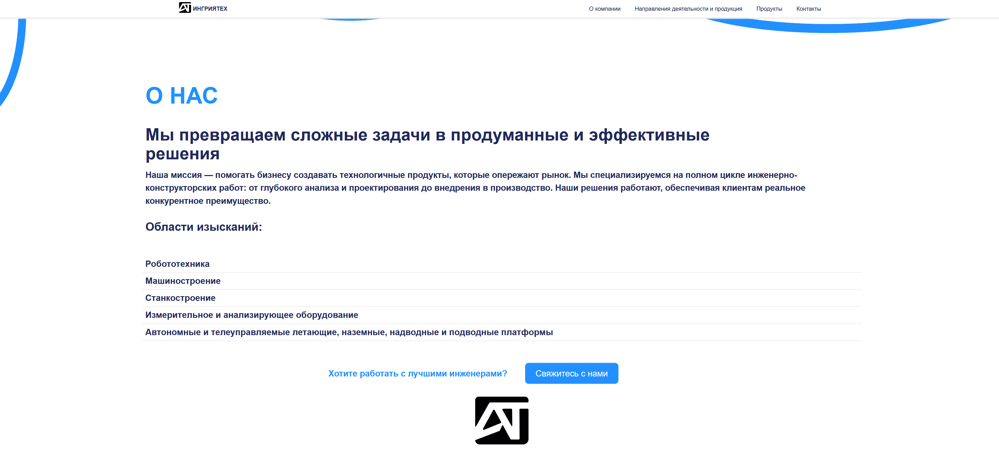
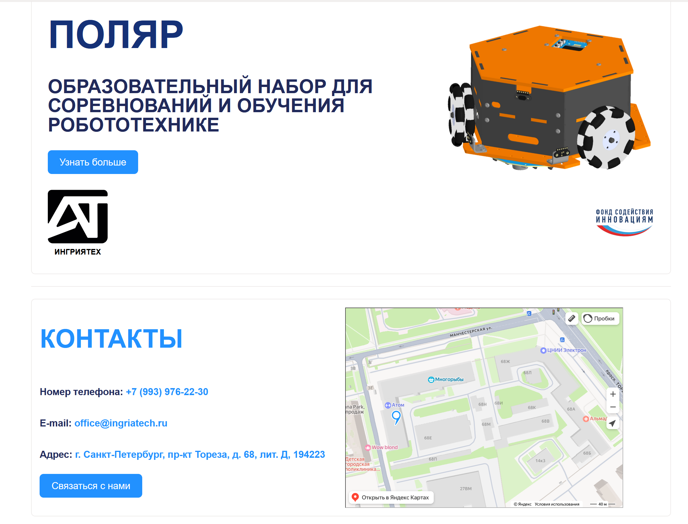
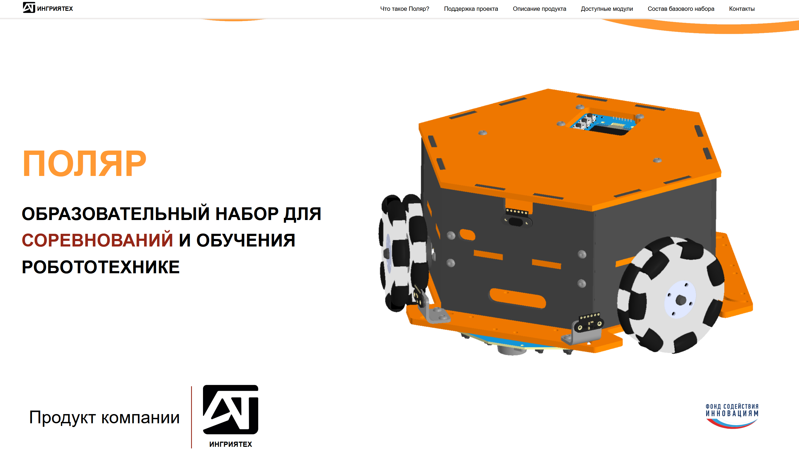
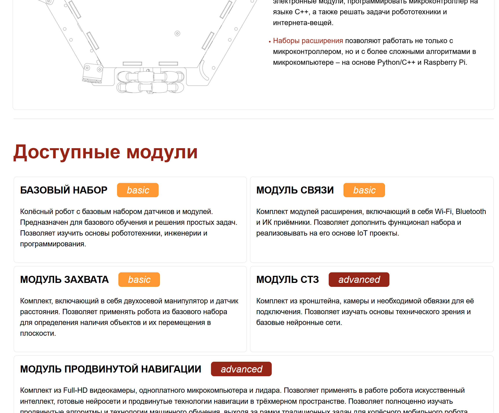

# Русский
## Описание
Это сайт лендинг написанный мной для компании, в которой я получил работу на его создание как приз за второе место в соревновании "Профессионалы" регионального этапа.
## Технические особенности
- Написан полностью на React с Typescript
- Для роутинга используется react-router
- Стили реализуются через CSS-модули
- Используется data-driven подход, весь текст и подобные данные вынесены в отдельный json файл для более удобного редактирования и вводятся в компоненты посредством Context API
- Присутствует мета-информация о страницах, ARIA-метки для доступности, семантическая вёрстка, alt-подписи изображений
- Сайт полностью адаптивный
- Дизайн и структуры выполнены в стиле согласно требованиям заказчика
- Присутствует интеграция Яндекс-карт 

# English
## Description
This is a landing site that I made for a company, where I got a job as a prize for taking second place in the regional stage of the international coding competition.
## Technical features
- Written in Typescript with React
- react-router library is used for implementing routing
- Styles are implemented using CSS modules system
- Data-Driven approach is used, all text and other content data are placed in the separate data for easier editing and injected into the components using the Context
- The pages include meta-information, ARIA labels for accessibility, semantic markup and alt-texts for images
- The website is entirely adaptive
- The design is created in a style and structure that meet the customer's requirements
- Has the maps integration

# Скриншоты/Screenshots

